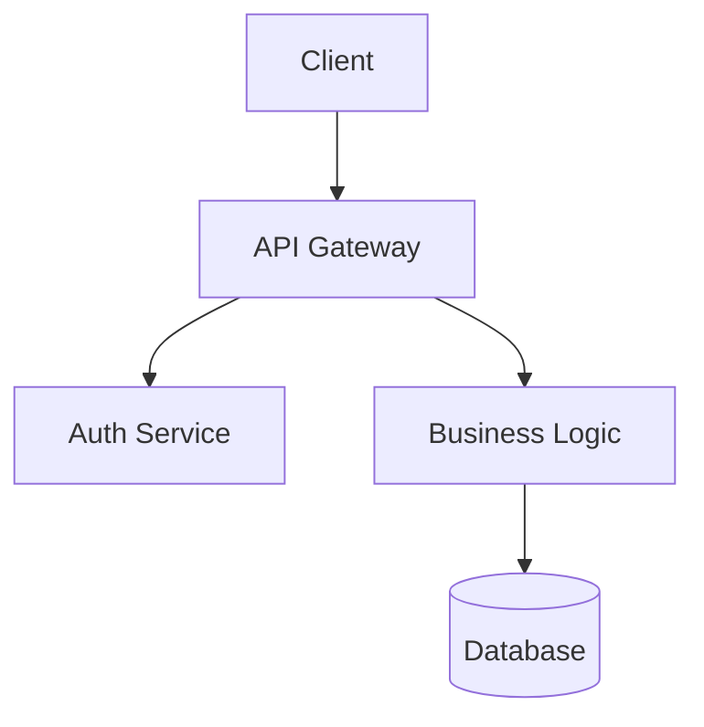
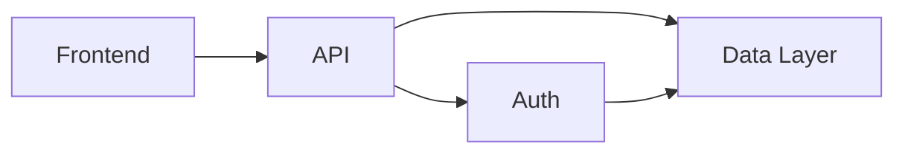
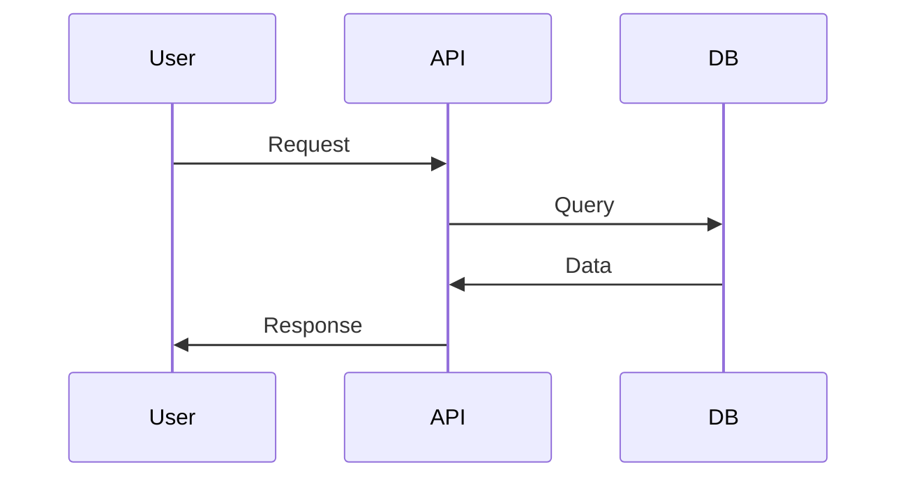
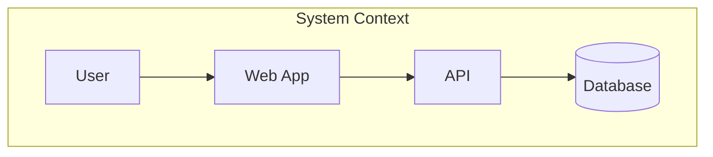

# Project MOC Generator

This skill generates comprehensive, GitHub-compatible Map of Content (MOC) documentation for software development projects. It analyzes your codebase's current state, extracts implemented features, documents architectural decisions, and creates a structured documentation hierarchy using standard markdown links that render perfectly on GitHub and other platforms.

## Capabilities

- **Project MOC Generation**: Creates top-level overview MOC linking to feature areas, architecture decisions, tech stack documentation, and component maps
- **Feature Documentation Extraction**: Analyzes implemented features in the codebase and generates feature-specific MOCs with component links and implementation details
- **Decision History Documentation**: Captures architectural and technical decisions, including what was considered but not implemented and the reasoning behind choices
- **Component Mapping**: Creates detailed documentation for each major component including code file links, dependencies, and implementation patterns
- **Devlog Analysis**: Reads and synthesizes information from `docs/devlog/` folder to understand project evolution and ongoing work
- **Standard Markdown Links**: Uses `[text](path)` format (not wiki-links) ensuring compatibility with GitHub, GitLab, and all markdown renderers
- **Date Tracking**: Includes frontmatter with generation dates to track when documentation was last updated
- **Current State Focus**: Documents features as they exist NOW, not intended or future features
- **Mermaid Diagrams**: Uses Mermaid for all visualizations (architecture, data flow, component relationships) - renders perfectly on GitHub

## Input Requirements

The skill expects:

- **Project root access**: Ability to read codebase structure and files
- **docs/ folder**: Output location where MOC files will be created
- **docs/devlog/ folder** (optional but recommended): Contains devlog entries, interstitial notes, or ongoing work documentation
- **Source code access**: To analyze actual implementation and extract feature details

Optional context that improves output:
- README.md or project documentation
- Architecture diagrams or notes
- CHANGELOG or version history
- Package configuration files (package.json, requirements.txt, etc.)

## Output Formats

All output is written to the `docs/moc/` folder in your project:

### Project MOC Structure
```
docs/
└── moc/
    ├── README.md           # Main entry point (auto-renders on GitHub!)
    ├── features.md         # Feature overview and catalog
    ├── architecture.md     # Architecture and design decisions
    ├── components.md       # Component maps and details
    └── decisions.md        # Architectural decision records (optional)
```

**Benefits of this structure:**
- Single `moc/` folder keeps all MOC files together
- `README.md` auto-renders when you navigate to `docs/moc/` on GitHub
- Lowercase filenames follow markdown conventions
- No `_MOC` suffix needed (folder context makes it clear)
- Won't conflict with existing docs/ files

### Frontmatter Format
Every generated MOC includes:
```yaml
---
title: Document Title
type: moc
generated: 2025-11-20
last_updated: 2025-11-20
project: [Extracted from package.json or project files]
---
```

### Link Format
All links use standard markdown (NOT wiki-links):
```markdown
# From docs/moc/README.md:
- [Features](./features.md)
- [Architecture](./architecture.md)
- [Components](./components.md)

# From any MOC file to source code:
- [Source Code](../../src/auth/index.ts)

# From README to MOC:
- [Project MOC](./docs/moc/README.md)
```

This ensures perfect rendering on GitHub, GitLab, and all markdown viewers.

## How to Use

Invoke the skill to generate comprehensive project documentation:

**Basic invocation:**
"Generate a complete project MOC for this codebase"

**Feature-focused:**
"Analyze the implemented features and create feature MOCs"

**Decision history:**
"Document the architectural decisions and what was considered but not implemented"

**Component mapping:**
"Create component maps for all major services and modules"

**Devlog synthesis:**
"Read the devlog folder and synthesize the project evolution"

**Full documentation:**
"Generate complete project documentation including MOCs for features, architecture, components, and decision history"

## Analysis Process

### 1. Project Discovery Phase
- Scan project root for configuration files (package.json, etc.)
- Identify main source directories
- Detect technology stack and frameworks
- Parse existing documentation in docs/ folder
- Analyze devlog/ entries for context

### 2. Feature Extraction Phase
- Read source code to identify implemented features
- Map features to their implementation files
- Extract feature descriptions from code comments and structure
- Document current feature capabilities (NOT future/planned features)
- Create feature dependency graph

### 3. Component Analysis Phase
- Identify major components, services, and modules
- Document component responsibilities and interfaces
- Map inter-component dependencies
- Link to source code files
- Extract implementation patterns

### 4. Decision Documentation Phase
- Analyze code for architectural patterns
- Review devlog for decision rationale
- Document technology choices
- Capture "roads not taken" with reasoning
- Link decisions to affected components

### 5. MOC Generation Phase
- Create `docs/moc/` directory
- Generate `README.md` as main entry point (auto-renders on GitHub)
- Create category MOCs with lowercase names (features.md, architecture.md, components.md)
- Add standard markdown links throughout
- Include date frontmatter on all documents
- Use simple, clean filenames without `_MOC` suffix
- **Add Mermaid diagrams for visualizations** (architecture, data flow, component relationships)

### 6. Integration Phase
- Ensure all links are valid and use correct paths
- Verify GitHub compatibility (no wiki-links)
- Update existing docs/ files if needed
- Create index structure for easy navigation

## Link Guidelines

**DO:**
- Use `[Text](./path/to/file.md)` for same-level links
- Use `[Text](../src/file.ts)` for source code links
- Use relative paths from document location
- Include file extensions (.md, .ts, .py, etc.)
- Test that links render on GitHub

**DON'T:**
- Use wiki-links `[[like this]]`
- Use absolute paths from root
- Omit file extensions
- Create circular link dependencies
- Link to non-existent files

## Frontmatter Fields

Every generated MOC includes these fields:

```yaml
---
title: "Human-readable title"
type: moc                    # Or: feature, component, architecture
generated: YYYY-MM-DD        # When first created
last_updated: YYYY-MM-DD     # When last regenerated
project: "Project Name"      # From package.json or similar
status: current              # Or: draft, archived
---
```

Additional optional fields:
- `tags`: List of relevant tags
- `version`: Project version this docs reflects
- `authors`: Primary contributors
- `related`: Links to related MOCs

## Diagram Guidelines

### Use Mermaid for All Visualizations

**ALWAYS use Mermaid diagrams** instead of ASCII art. Mermaid renders beautifully on GitHub and provides professional-looking visualizations.

**Common Diagram Types:**

**1. Architecture Diagrams (Flowchart):**


**2. Component Relationships (Graph):**


**3. Data Flow (Sequence):**


**4. System Architecture (C4 Context):**


**DON'T Use:**
- ASCII art boxes and arrows
- Text-based diagrams
- Non-rendering visualizations

**DO Use:**
- Mermaid flowchart for architecture
- Mermaid graph for component relationships
- Mermaid sequenceDiagram for data flow
- Mermaid classDiagram for data models

## Best Practices

1. **Run after significant feature work**: Generate MOCs when you've completed a feature or milestone to capture current state
2. **Maintain devlog alongside**: Keep notes in docs/devlog/ as you work - these provide valuable context for MOC generation
3. **Review and enhance**: Generated MOCs are starting points - add human insights, diagrams, and examples
4. **Update regularly**: Re-run the skill periodically to keep documentation in sync with code
5. **Commit to git**: Documentation changes should be tracked alongside code changes
6. **Link from README**: Add a link to `docs/moc/` from your main README for discoverability

## Use Cases

### For Development Teams
- Onboard new developers with comprehensive project overview
- Maintain living documentation that stays current
- Document "why" decisions were made for future reference
- Create knowledge base of features and components

### For Stakeholders
- Provide high-level project understanding without technical deep-dive
- Show what features are actually implemented vs planned
- Demonstrate architectural thinking and decision-making
- Create artifact suitable for reports or presentations

### For Future You
- Remember why you chose one approach over another
- Understand the project after time away
- Locate specific implementations quickly
- Reconstruct decision context

## Integration with Git Workflow

Recommended workflow:

```bash
# After completing feature work
claude @project-moc-generator "Generate updated project MOC"

# Review generated docs
git status

# Commit alongside code changes
git add docs/
git commit -m "feat: add user authentication

Updated docs with auth feature MOC and component maps"
```

## Limitations

- **Current state only**: Documents what exists, not what's planned or intended
- **No GitHub Issues integration**: Focuses on code, not issue tracker
- **Requires source code access**: Cannot document from external descriptions alone
- **Static snapshot**: Documentation reflects point in time, must be regenerated to stay current
- **Best with devlog**: Most effective when docs/devlog/ contains ongoing notes and context
- **Manual enhancement needed**: Generated docs are comprehensive but benefit from human refinement
- **Not a replacement for code comments**: Complements but doesn't replace inline documentation

## Output Location

All files are written to `docs/moc/` folder in your project root:
- `docs/moc/README.md` - Main entry point (auto-renders on GitHub)
- `docs/moc/features.md` - Feature catalog and status
- `docs/moc/architecture.md` - Architecture and design decisions
- `docs/moc/components.md` - Component maps and details
- `docs/devlog/` - User-maintained notes (read-only for this skill, analyzed for context)

This structure keeps all MOC documentation in one clean location, using lowercase filenames that follow standard markdown conventions.
