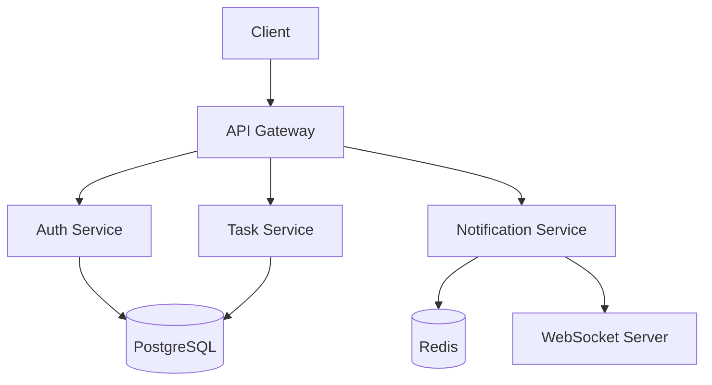
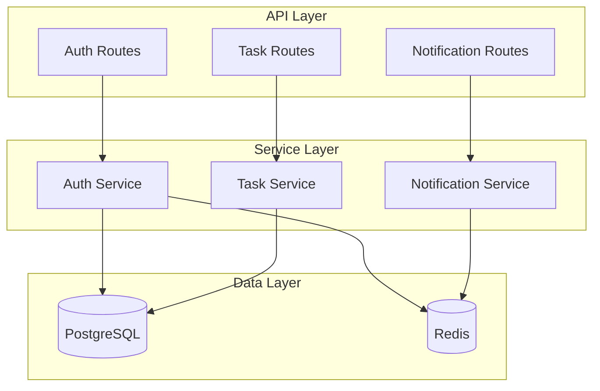
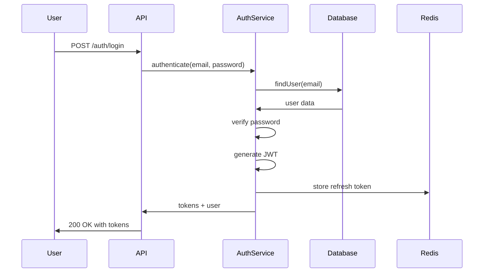

# Expected Output Example

This file shows example generated documentation from the Project MOC Generator skill.

## File Structure Created

```
docs/
├── moc/
│   ├── README.md               # Main entry point (auto-renders on GitHub!)
│   ├── features.md             # Feature catalog
│   ├── architecture.md         # Architecture and decisions
│   └── components.md           # Component maps
└── devlog/
    ├── 2025-11-15-api-redesign.md (existing, not modified)
    └── 2025-11-18-auth-implementation.md (existing, not modified)
```

**Benefits:**
- Clean single folder for all MOC files
- README.md auto-displays on GitHub
- Lowercase filenames
- No conflicts with existing docs

---

## Example: README.md (Main Entry Point)

```markdown
---
title: TaskFlow API - Project Map of Content
type: moc
generated: 2025-11-20
last_updated: 2025-11-20
project: TaskFlow API
version: 2.1.0
---

# TaskFlow API - Project Documentation

Welcome to the TaskFlow API project documentation. This Map of Content (MOC) provides a comprehensive overview of the project's features, architecture, and components.

## Quick Navigation

- [Features](./features.md) - What the API can do
- [Architecture](./architecture.md) - How it's built and key decisions
- [Components](./components.md) - Detailed component documentation

## Project Overview

**TaskFlow API** is a REST API with real-time WebSocket capabilities for task management and collaboration.

**Technology Stack:**
- Runtime: Node.js 20
- Language: TypeScript
- Framework: Express.js
- Database: PostgreSQL
- Caching: Redis
- Testing: Jest + Supertest

**Version:** 2.1.0

## Implemented Features

### Core Features
1. User Authentication - JWT-based auth with refresh tokens
2. Task Management - CRUD operations with filtering and sorting
3. Real-time Notifications - WebSocket-based task updates

See [features.md](./features.md) for complete feature documentation.

## Architecture

### System Architecture



### Key Decisions & Patterns
- Repository pattern for data access
- Service layer for business logic
- Middleware for cross-cutting concerns
- JWT tokens over sessions (decision rationale in architecture.md)

See [architecture.md](./architecture.md) for complete architecture documentation and decision log.

## Components

### Component Architecture



### Services
- Auth Service - Authentication and token management
- Task Service - Task business logic
- Notification Service - Real-time notifications

See [components.md](./components.md) for complete component documentation with source code links.

## Development Log

Project evolution and decisions are documented in [devlog/](./devlog/):
- [2025-11-15: API Redesign](./devlog/2025-11-15-api-redesign.md) - REST to hybrid REST+WebSocket
- [2025-11-18: Auth Implementation](./devlog/2025-11-18-auth-implementation.md) - JWT authentication approach

## Source Code

Key directories:
- [API Routes](../src/api/) - Express route handlers
- [Services](../src/services/) - Business logic layer
- [Models](../src/models/) - Data models and types
- [Middleware](../src/middleware/) - Request processing middleware
- [Utils](../src/utils/) - Shared utilities

## Getting Started

1. Read [Features Overview](./features/FEATURES_MOC.md) to understand capabilities
2. Review [Architecture Decisions](./architecture/decisions.md) for context
3. Explore [Component Maps](./components/COMPONENTS_MOC.md) for implementation details
4. Check [Development Log](./devlog/) for project evolution

---

*This MOC was generated on 2025-11-20 by the project-moc-generator skill.*
```

---

## Example: features/user-authentication.md

```markdown
---
title: User Authentication Feature
type: feature
generated: 2025-11-20
last_updated: 2025-11-20
project: TaskFlow API
status: implemented
---

# User Authentication

JWT-based authentication system with refresh token support for secure, stateless API access.

## Overview

The authentication feature provides secure user authentication using JSON Web Tokens (JWT). Users authenticate with credentials, receive access and refresh tokens, and can maintain sessions across requests.

## Capabilities

- User registration with email/password
- Login with credentials
- JWT access token generation (15-minute expiry)
- Refresh token generation (7-day expiry)
- Token validation and renewal
- Logout and token revocation
- Protected route middleware

## Implementation

### Authentication Flow



### Components

- [Auth API Routes](../../src/api/auth.ts) - HTTP endpoints for auth operations
- [Auth Service](../components/auth-service.md) - Authentication business logic
- [Auth Middleware](../../src/middleware/auth-middleware.ts) - Request authentication

### Endpoints

**POST /api/auth/register**
- Register new user
- Input: email, password, name
- Output: user object, access token, refresh token

**POST /api/auth/login**
- Authenticate user
- Input: email, password
- Output: user object, access token, refresh token

**POST /api/auth/refresh**
- Refresh access token
- Input: refresh token
- Output: new access token

**POST /api/auth/logout**
- Revoke tokens and logout
- Input: refresh token
- Output: success confirmation

### Security

- Passwords hashed with bcrypt (10 rounds)
- JWTs signed with RS256 algorithm
- Refresh tokens stored in Redis with expiry
- Access tokens validated on every protected request

## Architecture Decisions

### Why JWT?

**Decision:** Use JWT tokens for authentication

**Context:** Needed stateless authentication for mobile clients and future microservices architecture.

**Alternatives Considered:**
1. **Session-based auth** - Rejected: Requires server-side session storage, doesn't scale horizontally
2. **OAuth2** - Rejected: Too complex for current needs, adds external dependencies
3. **API Keys** - Rejected: Less secure, no user context

**Trade-offs:**
- ✅ Stateless (no session storage needed)
- ✅ Works across services
- ✅ Mobile-friendly
- ❌ Cannot revoke tokens before expiry (mitigated with short expiry + refresh tokens)
- ❌ Token size larger than session IDs

**Implementation:** Access tokens expire in 15 minutes, refresh tokens in 7 days. Refresh tokens stored in Redis for revocation capability.

See [Auth Decision Log](../architecture/decisions.md#authentication-approach) for detailed rationale.

## Usage Examples

### Register User
```typescript
POST /api/auth/register
{
  "email": "user@example.com",
  "password": "SecurePassword123!",
  "name": "John Doe"
}

Response:
{
  "user": { "id": "uuid", "email": "user@example.com", "name": "John Doe" },
  "accessToken": "eyJhbGc...",
  "refreshToken": "eyJhbGc..."
}
```

### Login
```typescript
POST /api/auth/login
{
  "email": "user@example.com",
  "password": "SecurePassword123!"
}

Response:
{
  "user": { "id": "uuid", "email": "user@example.com", "name": "John Doe" },
  "accessToken": "eyJhbGc...",
  "refreshToken": "eyJhbGc..."
}
```

### Protected Request
```typescript
GET /api/tasks
Headers:
  Authorization: Bearer eyJhbGc...

Response: (tasks if token valid, 401 if invalid/expired)
```

## Dependencies

- [Auth Service](../components/auth-service.md) - Core authentication logic
- PostgreSQL - User credential storage
- Redis - Refresh token storage
- bcrypt - Password hashing
- jsonwebtoken - JWT generation/validation

## Related Features

- [Task Management](./task-management.md) - Uses auth for protected endpoints
- [Real-time Notifications](./real-time-notifications.md) - WebSocket authentication

## Future Enhancements

- Multi-factor authentication (MFA)
- Social login (Google, GitHub)
- Password reset flow
- Account email verification

---

*Feature implemented and documented 2025-11-20*
```

---

## Example: architecture/decisions.md

```markdown
---
title: Architecture Decision Log
type: architecture
generated: 2025-11-20
last_updated: 2025-11-20
project: TaskFlow API
---

# Architecture Decision Log

This document records significant architectural and technical decisions made during the development of TaskFlow API, including alternatives considered and rationale.

## ADR-001: Hybrid REST + WebSocket Architecture

**Date:** 2025-11-15

**Status:** Implemented

**Context:**
Initial API was pure REST. Need to add real-time notifications for task updates without polling.

**Decision:**
Adopt hybrid architecture using REST for CRUD operations and WebSocket for real-time push notifications.

**Alternatives Considered:**

1. **Pure REST with polling**
   - ❌ Inefficient: clients poll every N seconds
   - ❌ Delayed notifications (up to polling interval)
   - ❌ Increased server load and bandwidth

2. **Server-Sent Events (SSE)**
   - ✅ Simple, HTTP-based
   - ❌ Unidirectional (server to client only)
   - ❌ Limited browser support
   - ❌ Doesn't support binary data

3. **GraphQL Subscriptions**
   - ✅ Type-safe, good dev experience
   - ❌ Requires complete GraphQL migration
   - ❌ Adds complexity for simple notifications

4. **WebSocket (chosen)**
   - ✅ Bidirectional communication
   - ✅ Low latency
   - ✅ Standard protocol, excellent support
   - ✅ Can add more real-time features later
   - ❌ More complex than REST
   - ❌ Requires connection management

**Rationale:**
WebSocket provides best balance of performance and flexibility. REST remains for CRUD (caching, standard HTTP semantics), WebSocket handles real-time push.

**Implementation Notes:**
- REST endpoints for task CRUD
- WebSocket for notifications of task changes
- Clients can choose REST-only if real-time not needed
- WebSocket connection authenticated with JWT

**References:**
- [devlog/2025-11-15-api-redesign.md](../devlog/2025-11-15-api-redesign.md)
- [Real-time Notifications Feature](../features/real-time-notifications.md)

---

## ADR-002: JWT Authentication

**Date:** 2025-11-18

**Status:** Implemented

**Context:**
Need secure authentication for API that works with web and mobile clients. Future plans for microservices require stateless auth.

**Decision:**
Use JWT (JSON Web Tokens) with short-lived access tokens (15 min) and longer-lived refresh tokens (7 days).

**Alternatives Considered:**

1. **Session-based authentication**
   - ✅ Simple, well-understood
   - ✅ Easy to revoke
   - ❌ Requires server-side session storage (Redis/database)
   - ❌ Doesn't scale horizontally without sticky sessions
   - ❌ Complex with mobile clients

2. **OAuth2 / OpenID Connect**
   - ✅ Industry standard
   - ✅ Supports social login
   - ❌ Overly complex for current needs
   - ❌ Requires external identity provider or complex setup
   - ❌ Overkill for simple API

3. **API Keys**
   - ✅ Very simple
   - ❌ Less secure (no expiration)
   - ❌ No user context in token
   - ❌ Difficult to rotate

4. **JWT (chosen)**
   - ✅ Stateless (no server-side storage for access tokens)
   - ✅ Works across services (future microservices)
   - ✅ Good mobile client support
   - ✅ Contains user context (claims)
   - ❌ Cannot revoke before expiry
   - ❌ Larger than session IDs

**Rationale:**
JWT provides stateless authentication suitable for mobile and future microservices. Short access token expiry (15 min) mitigates inability to revoke. Refresh tokens stored in Redis enable revocation when needed.

**Implementation Notes:**
- Access tokens: 15-minute expiry, RS256 signing
- Refresh tokens: 7-day expiry, stored in Redis
- Logout revokes refresh token
- Auth middleware validates access token on protected routes

**Trade-offs Accepted:**
- Cannot revoke access tokens before 15-minute expiry (acceptable risk)
- Tokens larger than session IDs (negligible bandwidth impact)
- Need Redis for refresh token storage (already using for caching)

**References:**
- [devlog/2025-11-18-auth-implementation.md](../devlog/2025-11-18-auth-implementation.md)
- [User Authentication Feature](../features/user-authentication.md)
- [Auth Service Component](../components/auth-service.md)

---

## ADR-003: PostgreSQL for Primary Database

**Date:** 2025-10-01

**Status:** Implemented

**Context:**
Need relational database for structured task data with relationships (users, tasks, projects, tags).

**Decision:**
Use PostgreSQL as primary database.

**Alternatives Considered:**

1. **MySQL**
   - ✅ Widely used, good ecosystem
   - ❌ Less advanced features than PostgreSQL
   - ❌ JSON support not as robust

2. **MongoDB**
   - ✅ Flexible schema
   - ✅ Good for rapid prototyping
   - ❌ Tasks have clear relational structure
   - ❌ No ACID guarantees across documents
   - ❌ More complex for relational queries

3. **PostgreSQL (chosen)**
   - ✅ Full ACID compliance
   - ✅ Excellent JSON support (JSONB)
   - ✅ Advanced indexing and query optimization
   - ✅ Strong type system
   - ✅ Great ecosystem (ORMs, tools)
   - ❌ Slightly more complex setup than MySQL

**Rationale:**
Tasks naturally relational (users own tasks, tasks belong to projects, tasks have tags). PostgreSQL provides relational integrity while maintaining flexibility with JSONB for metadata.

**Implementation Notes:**
- Use TypeORM for database access
- JSONB columns for flexible metadata
- Indexes on frequently queried columns
- Foreign key constraints for referential integrity

---

## ADR-004: Redis for Caching and Session Storage

**Date:** 2025-10-05

**Status:** Implemented

**Context:**
Need caching layer for frequently accessed data and storage for refresh tokens.

**Decision:**
Use Redis for caching and refresh token storage.

**Alternatives Considered:**

1. **In-memory (Node.js process)**
   - ✅ Simple, no external dependency
   - ❌ Doesn't persist across restarts
   - ❌ Doesn't work with multiple server instances
   - ❌ Limited by process memory

2. **Memcached**
   - ✅ Simple, fast
   - ❌ No data structures (only key-value)
   - ❌ No persistence option
   - ❌ Less features than Redis

3. **Redis (chosen)**
   - ✅ Fast in-memory operations
   - ✅ Rich data structures (sets, hashes, lists)
   - ✅ Optional persistence
   - ✅ TTL support (perfect for refresh tokens)
   - ✅ Pub/sub for future real-time features
   - ❌ Additional infrastructure dependency

**Rationale:**
Redis provides more than simple caching: TTL for refresh tokens, data structures for complex caching strategies, pub/sub for potential future features.

**Implementation Notes:**
- Cache frequently accessed task lists (5-minute TTL)
- Store refresh tokens with 7-day TTL
- Invalidate cache on updates
- Use Redis pub/sub for future notification broadcasting

---

## Summary

Key architectural decisions prioritize:
1. **Scalability** - Stateless auth, horizontal scaling support
2. **Performance** - Redis caching, efficient real-time updates
3. **Flexibility** - Hybrid REST+WebSocket, JSONB for metadata
4. **Security** - JWT with short expiry, bcrypt password hashing
5. **Maintainability** - TypeScript, clear separation of concerns, standard patterns

---

*Decision log maintained by project-moc-generator skill. Last updated 2025-11-20.*
```

---

## Example: components/COMPONENTS_MOC.md

```markdown
---
title: Components Map of Content
type: moc
generated: 2025-11-20
last_updated: 2025-11-20
project: TaskFlow API
---

# Components Documentation

Comprehensive documentation of all major components in the TaskFlow API.

## Service Layer

### Authentication
- [Auth Service](./auth-service.md) - User authentication and token management
  - JWT generation and validation
  - Refresh token management
  - Password hashing and verification

### Task Management
- [Task Service](./task-service.md) - Task business logic
  - CRUD operations
  - Filtering and sorting
  - Task assignment and status management

### Notifications
- [Notification Service](./notification-service.md) - Real-time notification handling
  - WebSocket connection management
  - Event broadcasting
  - Notification queueing

## API Layer

### Route Handlers
- [Auth Routes](../../src/api/auth.ts) - Authentication endpoints
- [Task Routes](../../src/api/tasks.ts) - Task management endpoints
- [User Routes](../../src/api/users.ts) - User management endpoints

## Middleware Layer

### Request Processing
- [Auth Middleware](../../src/middleware/auth-middleware.ts) - JWT validation
- [Error Middleware](../../src/middleware/error-middleware.ts) - Error handling
- [Validation Middleware](../../src/middleware/validation-middleware.ts) - Request validation

## Data Layer

### Models
- [User Model](../../src/models/user.ts) - User entity
- [Task Model](../../src/models/task.ts) - Task entity
- [Project Model](../../src/models/project.ts) - Project entity

### Repositories
- [Task Repository](../../src/repositories/task-repository.ts) - Task data access

## Utilities

### Shared
- [Logger](../../src/utils/logger.ts) - Application logging
- [Validators](../../src/utils/validators.ts) - Input validation
- [Crypto Utils](../../src/utils/crypto.ts) - Encryption and hashing

## Component Relationships

```
API Routes
    ↓
Services (Business Logic)
    ↓
Repositories (Data Access)
    ↓
Database (PostgreSQL)

Middleware processes all requests before reaching routes
```

## See Also

- [Features MOC](../features/FEATURES_MOC.md) - Feature-based view
- [Architecture MOC](../architecture/ARCHITECTURE_MOC.md) - Architecture overview
- [PROJECT_MOC](../PROJECT_MOC.md) - Complete project documentation

---

*Component documentation generated 2025-11-20*
```

---

## Key Characteristics of Output

1. **Standard Markdown Links**: All links use `[text](path)` format, never `[[wiki-links]]`
2. **Date Tracking**: Every document has `generated` and `last_updated` in frontmatter
3. **Current State Only**: Documents what IS implemented, not what's planned
4. **GitHub Compatible**: Renders perfectly on GitHub, GitLab, etc.
5. **Navigable Structure**: Clear hierarchy with MOCs linking to detailed docs
6. **Source Code Links**: Direct links to implementation files
7. **Decision Context**: Captures "why" alongside "what"
8. **Devlog Integration**: Synthesizes information from ongoing notes

This output structure provides comprehensive, navigable, stakeholder-friendly documentation that stays current with the codebase.
