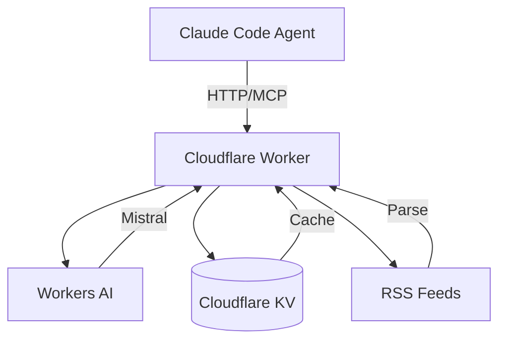
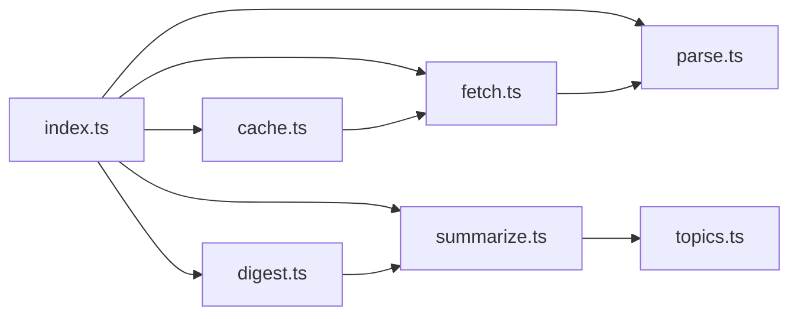

# RSS Agent - Map of Content

This is the comprehensive documentation hub for the RSS Agent project - a proving ground for agent infrastructure patterns, built as a Cloudflare Worker that fetches, parses, caches, and AI-summarizes RSS feeds.

## Project Overview

**RSS Agent** validates architectural patterns using a low-stakes RSS fetching system before applying them to production projects. The core pattern: **Cloudflare Worker as MCP endpoint invoked by Claude Code agents**.



**Status:** Product vision complete (Phase 4) - All core features implemented
**Test Coverage:** 267 tests (209 unit, 58 agent workflows)
**Deployment:** Cloudflare Edge (production, staging, dev environments)

## Documentation Navigation

### Core Documentation

- [Features](./features.md) - Implemented capabilities and API endpoints
- [Architecture](./architecture.md) - System design, patterns, and decisions
- [Components](./components.md) - Code modules and their responsibilities

### Additional Resources

- [CLAUDE.md](../../CLAUDE.md) - Project instructions and technical decisions
- [Devlog](../devlog/) - Development journey and decision rationale
- [Worker Source](../../worker/src/) - Implementation code

## Quick Links

### API Endpoints

| Endpoint | Method | Purpose |
|----------|--------|---------|
| `/health` | GET | Service health check |
| `/fetch` | POST | Single feed with caching |
| `/batch` | POST | Parallel multi-feed fetching |
| `/summarize` | POST | AI-powered article summarization |
| `/digest` | POST | Complete fetch → summarize → format pipeline |

See [Features](./features.md) for detailed endpoint documentation.

### Key Architectural Patterns

- **Edge AI:** Workers AI at the edge (Mistral model, no Meta/Facebook)
- **Caching Strategy:** 15min for feeds, 24h for summaries (KV-based)
- **Rate Limiting:** Per-client IP with configurable windows
- **API-First:** Multi-consumer architecture (agents, scripts, MCP)
- **Test-Driven:** Comprehensive test suite validates workflows

See [Architecture](./architecture.md) for design decisions and patterns.

### Component Overview



See [Components](./components.md) for module details and interfaces.

## System Context

### Technology Stack

- **Runtime:** Cloudflare Workers (TypeScript)
- **Storage:** Cloudflare KV (caching)
- **AI:** Workers AI (@cf/mistralai/mistral-small-3.1-24b-instruct)
- **Testing:** Vitest with Cloudflare pool
- **Deployment:** Wrangler (3 environments)

### Built-in Collections

- `ai-ml` - AI & Machine Learning (Hugging Face, OpenAI)
- `tech-news` - Tech News (Ars Technica, The Verge)
- `dev-tools` - Development & Infrastructure (Cloudflare, GitHub)

### Design Principles

1. **Values-based decisions:** No Meta/Facebook models
2. **Edge-first:** Sub-50ms global latency
3. **Cache-first:** Expensive operations once, cheap retrieval forever
4. **Agent-ready:** Natural language interface via Claude Code
5. **API-first:** Multiple consumers (CLI, agents, MCP, webhooks)

## Evolution Timeline

| Phase | Milestone | Status |
|-------|-----------|--------|
| Phase 1 | Core RSS fetching + caching | ✅ Complete |
| Phase 2 | Batch operations + rate limiting | ✅ Complete |
| Phase 3 | Agent integration (Claude Code) | ✅ Complete |
| Phase 4 | AI summarization + topics | ✅ Complete |
| Phase 5 | Orchestrator (batch scheduling) | 📋 Planned |

See [Devlog: Product Vision Complete](../devlog/2025-11-29-product-vision-complete.md) for the full journey.

## Key Insights from Development

### The Agent as Interface

Traditional tools have rigid interfaces (CLI flags, API docs). With agent integration, users express intent in natural language, and the agent translates to API calls.

**Before (traditional):**
```bash
curl -X POST https://rss-agent.mpazbot.workers.dev/fetch \
  -H "Content-Type: application/json" \
  -d '{"url": "...", "since": "24h", "limit": 5}'
```

**After (agent interface):**
```
What's new in AI from the last day?
```

See [Devlog: Agent as Interface](../devlog/2025-11-29-agent-as-interface.md) for implications.

### Edge AI Economics

Workers AI runs at the edge, bundled with compute. The first request pays AI cost, subsequent requests serve from cache (24h TTL). This makes it practical to summarize everything, not just selected articles.

See [Devlog: AI Summarization](../devlog/2025-11-29-ai-summarization-complete.md) for details.

### Values in Practice

Choosing Mistral over Llama isn't about technical capability - both work fine. It's about intentionality in which companies we support with our usage.

See [Devlog: No Meta Models](../devlog/2025-11-29-no-meta-models.md) for rationale.

## Related Repositories

- [orchestrator](https://github.com/mpazaryna/orchestrator) - Skill definitions and batch execution
- [claude-toolkit](https://github.com/mpazaryna/claude-toolkit) - Agent definitions
- [systemata](https://github.com/mpazaryna/systemata) - Configuration files (feeds.opml, feed-collections.json)

## Getting Started

### Local Development

```bash
cd worker
npm install
npm run dev        # Start local dev server
npm run typecheck  # Run type checking
npm run test       # Run test suite
```

### Deployment

```bash
npm run deploy              # Production
wrangler deploy --env dev   # Development
wrangler deploy --env staging  # Staging
```

### Example Usage

**Fetch a feed:**
```bash
curl -X POST https://rss-agent.mpazbot.workers.dev/fetch \
  -d '{"url": "https://huggingface.co/blog/feed.xml", "since": "7d", "limit": 3}'
```

**Generate digest:**
```bash
curl -X POST https://rss-agent.mpazbot.workers.dev/digest \
  -d '{"collection": "ai-ml", "since": "7d", "limit": 3, "format": "markdown"}'
```

See [Features](./features.md) for complete API documentation.

## Project Metrics

- **Version:** 1.0.0
- **Test Count:** 267 (209 unit + 58 agent workflows)
- **Endpoints:** 5 (health, fetch, batch, summarize, digest)
- **Components:** 14 TypeScript modules
- **Collections:** 3 built-in (ai-ml, tech-news, dev-tools)
- **AI Model:** Mistral Small 3.1 24B Instruct
- **Cache Strategy:** 15min feeds, 24h summaries
- **Rate Limit:** Configurable per-client

## What This Proves

This project validates patterns for production use:

1. **Edge AI is practical** for content processing pipelines
2. **Caching transforms economics** - expensive operations become cheap on repeat
3. **API-first enables evolution** - same capability, multiple consumers
4. **Values-based technical decisions work** - no compromises required
5. **TDD works for AI features** - 267 tests gave us confidence, not slowdown
6. **Agents change interfaces** - conversation beats command-line syntax

The RSS use case is almost incidental. We built infrastructure patterns that happen to process feeds.

---

**Last Updated:** November 30, 2025
**Generated by:** Claude Code project-moc-generator
