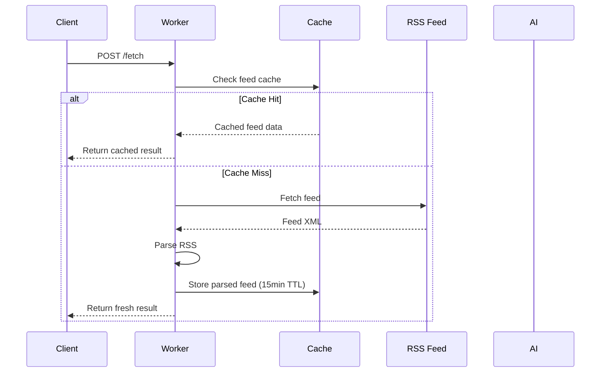
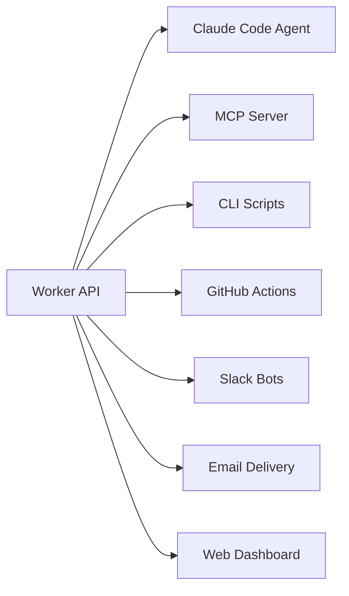
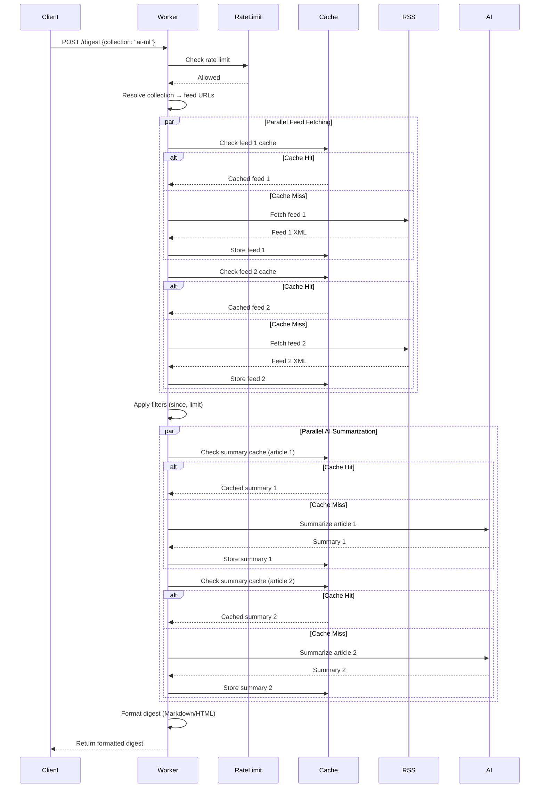
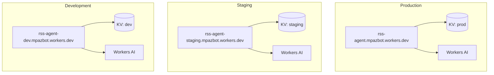

# RSS Agent - Architecture

This document describes the system architecture, design patterns, and architectural decisions for the RSS Agent project.

[← Back to MOC](./README.md)

## Table of Contents

- [System Architecture](#system-architecture)
- [Design Patterns](#design-patterns)
- [Architectural Decisions](#architectural-decisions)
- [Data Flow](#data-flow)
- [Deployment Architecture](#deployment-architecture)
- [Security & Performance](#security--performance)

---

## System Architecture

### High-Level Overview

```mermaid
flowchart TB
    subgraph "Client Layer"
        A[Claude Code Agent]
        B[MCP Client]
        C[CLI/Scripts]
        D[GitHub Actions]
    end

    subgraph "Cloudflare Edge"
        E[Worker Entry Point]
        E --> F[Request Router]
        F --> G[/health]
        F --> H[/fetch]
        F --> I[/batch]
        F --> J[/summarize]
        F --> K[/digest]
    end

    subgraph "Core Services"
        H --> L[Feed Fetcher]
        I --> L
        L --> M[RSS Parser]
        L --> N[Cache Manager]

        J --> O[Article Extractor]
        O --> P[AI Summarizer]
        P --> Q[Topic Extractor]

        K --> L
        K --> P
        K --> R[Digest Formatter]
    end

    subgraph "External Services"
        L --> S[RSS Feeds]
        O --> S
        P --> T[Workers AI]
        N --> U[(Cloudflare KV)]
    end

    A --> E
    B --> E
    C --> E
    D --> E
```

### Core Components

| Component | Responsibility | Key Files |
|-----------|---------------|-----------|
| **Entry Point** | Request routing, error handling | [index.ts](../../worker/src/index.ts) |
| **Feed Fetcher** | HTTP fetching, cache integration | [fetch.ts](../../worker/src/fetch.ts) |
| **RSS Parser** | RSS 2.0 & Atom parsing | [parse.ts](../../worker/src/parse.ts) |
| **Cache Manager** | KV storage abstraction | [cache.ts](../../worker/src/cache.ts), [summary-cache.ts](../../worker/src/summary-cache.ts) |
| **AI Summarizer** | Workers AI integration | [summarize.ts](../../worker/src/summarize.ts) |
| **Topic Extractor** | Keyword extraction | [topics.ts](../../worker/src/topics.ts) |
| **Article Extractor** | Full article content retrieval | [article.ts](../../worker/src/article.ts) |
| **Digest Formatter** | Markdown/HTML generation | [digest.ts](../../worker/src/digest.ts) |
| **Rate Limiter** | Request throttling | [ratelimit.ts](../../worker/src/ratelimit.ts) |
| **Validator** | URL validation | [validate.ts](../../worker/src/validate.ts) |

---

## Design Patterns

### 1. Edge-First Architecture

**Pattern:** Deploy computation to the edge, close to users globally.

**Implementation:**
- Cloudflare Workers run in 300+ global locations
- Sub-50ms latency for most requests
- Automatic scaling and load balancing

**Benefits:**
- Global performance consistency
- No server management
- Pay-per-request pricing

**Trade-offs:**
- 10ms CPU time limit per request
- Limited Node.js API compatibility
- Stateless execution model

**Code Example:**
```typescript
// worker/src/index.ts
export default {
  async fetch(request: Request, env: Env): Promise<Response> {
    // Executes at nearest Cloudflare edge location
    const url = new URL(request.url);

    if (url.pathname === "/health") {
      return jsonResponse({ status: "ok" });
    }

    return handleRequest(request, env);
  }
}
```

---

### 2. Cache-First Strategy

**Pattern:** Check cache before expensive operations, cache results aggressively.

**Implementation:**



**Cache Layers:**

| Layer | TTL | Key Pattern | Purpose |
|-------|-----|-------------|---------|
| Feed Content | 15 min | `feed:{hash}:content` | Parsed feed JSON |
| Feed ETag | 15 min | `feed:{hash}:etag` | Conditional request header |
| Feed Modified | 15 min | `feed:{hash}:modified` | Last-Modified header |
| AI Summary | 24 hours | `summary:{hash}:{style}` | AI-generated summaries |

**Benefits:**
- Reduces origin load on RSS servers
- Minimizes AI compute costs
- Improves response latency
- Enables team sharing (cached summaries benefit all users)

**Code Example:**
```typescript
// worker/src/fetch.ts
export async function fetchFeedWithCache(
  url: string,
  cache: KVNamespace
): Promise<ParseResult> {
  const cacheKey = await getCacheKey(url);

  // Check cache first
  const cached = await cache.get(cacheKey, "json");
  if (cached) {
    return { ...cached, cached: true };
  }

  // Cache miss - fetch and parse
  const result = await fetchFeed(url);

  if (result.success) {
    // Store for 15 minutes
    await cache.put(cacheKey, JSON.stringify(result), {
      expirationTtl: 900
    });
  }

  return { ...result, cached: false };
}
```

---

### 3. API-First, Multi-Consumer Design

**Pattern:** Build HTTP API as foundation, enable multiple consumer types.

**Consumers:**



**Benefits:**
- Single implementation, multiple interfaces
- Consistent behavior across consumers
- Easy to add new consumers
- Testable without UI dependencies

**Design Principle:**
> The API exists to be called by agents, not humans. Optimize for machine-parseable responses.

**Code Example:**
```typescript
// Structured, machine-parseable error responses
function errorResponse(error: ErrorResponse, status: number): Response {
  return jsonResponse({
    error: error.error,        // Machine-readable code
    message: error.message,    // Human-readable description
    retryAfter: error.retryAfter  // Optional retry guidance
  }, status);
}
```

---

### 4. Agent as Interface Layer

**Pattern:** Natural language interface via Claude Code agent, hiding API complexity.

**Traditional Interface:**
```bash
# User must learn API structure, authentication, parameters
curl -X POST https://rss-agent.mpazbot.workers.dev/batch \
  -H "Content-Type: application/json" \
  -d '{
    "feeds": [{"url": "https://..."}, {"url": "https://..."}],
    "since": "7d",
    "limit": 5,
    "summarize": true,
    "summaryStyle": "brief"
  }'
```

**Agent Interface:**
```
What's new in AI from the last week? Give me brief summaries.
```

**Agent Translation:**
1. Parses intent: "AI news", "last week", "brief summaries"
2. Reads config: Finds `ai-ml` collection
3. Constructs request: `/batch` with appropriate parameters
4. Formats response: Presents results in readable format

**Benefits:**
- Zero learning curve for users
- Configuration as shared context
- Agent handles complexity
- Natural language queries

**Reference:** See [Devlog: Agent as Interface](../devlog/2025-11-29-agent-as-interface.md)

---

### 5. Parallel Execution Pattern

**Pattern:** Execute independent operations concurrently using Promise.all.

**Implementation:**

```typescript
// worker/src/index.ts - Batch feed fetching
const fetchPromises = body.feeds.map(async (feed) => {
  const result = await fetchFeedWithCache(feed.url, env.FEED_CACHE);

  if (body.summarize) {
    // Summarize all items in parallel
    const itemsWithSummaries = await Promise.all(
      result.items.map(async (item) => {
        const summary = await getCachedSummary(env.FEED_CACHE, item.url);
        if (summary) return { ...item, summary: summary.summary };

        // Fetch article and summarize
        const article = await fetchArticleContent(item.url);
        const summarized = await summarizeText(article.content, env.AI);

        return { ...item, summary: summarized.summary };
      })
    );

    return { ...result, items: itemsWithSummaries };
  }

  return result;
});

const results = await Promise.all(fetchPromises);
```

**Performance Impact:**
- Sequential: ~N × (fetch_time + summarize_time)
- Parallel: ~max(fetch_time) + max(summarize_time)

**Example:**
- 5 feeds × (500ms fetch + 1000ms summarize) = ~7.5s sequential
- max(500ms) + max(1000ms) = ~1.5s parallel
- **5x speedup**

---

### 6. Error Isolation Pattern

**Pattern:** Isolate errors per feed in batch operations, return partial success.

**Behavior:**
```json
{
  "success": true,
  "results": [
    { "url": "https://feed1.xml", "success": true, "items": [...] },
    { "url": "https://feed2.xml", "success": false, "error": "timeout" },
    { "url": "https://feed3.xml", "success": true, "items": [...] }
  ],
  "meta": {
    "totalFeeds": 3,
    "successCount": 2,
    "failureCount": 1
  }
}
```

**Benefits:**
- One feed failure doesn't block others
- Clear success/failure attribution
- Client can retry only failed items

---

## Architectural Decisions

### ADR-001: TypeScript on Cloudflare Workers

**Context:** Need fast, globally distributed API with minimal operational overhead.

**Decision:** Use TypeScript on Cloudflare Workers instead of Python local app (original design).

**Rationale:**
- Edge deployment → sub-50ms global latency
- Workers AI bundled → no separate AI API costs
- KV storage included → built-in caching
- Automatic scaling → no capacity planning
- TypeScript → strong typing, excellent tooling

**Consequences:**
- Positive: Global performance, zero server management, integrated AI/KV
- Negative: 10ms CPU limit, stateless execution, Cloudflare lock-in
- Mitigation: Worker code is portable to other edge runtimes (Deno Deploy, Fastly)

**Status:** Accepted, implemented

**Reference:** [Devlog: Product Vision Complete](../devlog/2025-11-29-product-vision-complete.md)

---

### ADR-002: No Meta/Facebook AI Models

**Context:** Workers AI offers multiple model providers including Meta (Llama, BART).

**Decision:** Exclude all Meta/Facebook models from this project. Use Mistral as primary provider.

**Rationale:**
- Values-based decision: Meta's history of privacy violations, harmful content amplification
- Technical equivalence: Mistral Small 3.1 24B matches or exceeds Llama performance for our use cases
- Intentionality: Small decisions about which companies we support matter

**Approved Models:**
- Primary: `@cf/mistralai/mistral-small-3.1-24b-instruct`
- Alternative: `@cf/google/gemma-3-12b-it`
- Others: Qwen, IBM models

**Consequences:**
- Positive: Alignment between tools and values
- Negative: Slightly smaller model ecosystem
- Mitigation: Approved models are competitive with excluded ones

**Status:** Accepted, documented in [CLAUDE.md](../../CLAUDE.md)

**Reference:** [Devlog: No Meta Models](../devlog/2025-11-29-no-meta-models.md)

---

### ADR-003: 24-Hour Summary Cache TTL

**Context:** AI summarization is expensive (compute cost, latency). Need balance between freshness and performance.

**Decision:** Cache AI summaries for 24 hours.

**Rationale:**
- Article content rarely changes after publication
- 24h enables "daily digest" use case with mostly cached results
- First user pays AI cost, subsequent users get instant results
- Economic model: expensive operation once, cheap retrieval forever

**Consequences:**
- Positive: Dramatic cost reduction, sub-100ms cached response
- Negative: Summaries don't reflect article updates within 24h
- Mitigation: `forceRefresh` parameter available for manual cache bypass

**Status:** Accepted, implemented

---

### ADR-004: Embedded Collections vs. External Config

**Context:** Need to group feeds into collections (ai-ml, tech-news, dev-tools).

**Decision:** Embed collections in worker code rather than fetching from external config.

**Implementation:**
```typescript
// worker/src/digest.ts
export const COLLECTIONS: Record<string, {...}> = {
  "ai-ml": {
    name: "AI & Machine Learning",
    feeds: [
      { url: "https://huggingface.co/blog/feed.xml", name: "Hugging Face" },
      { url: "https://openai.com/blog/rss.xml", name: "OpenAI" }
    ]
  },
  // ...
};
```

**Rationale:**
- Worker is self-contained, no external dependencies
- No additional HTTP request for config fetch
- Collections are relatively stable (infrequent updates)
- Easy to version control with code

**Consequences:**
- Positive: Zero external dependencies, faster cold start
- Negative: Collection updates require code deployment
- Mitigation: For frequently-changing collections, use `/batch` endpoint with custom feed array

**Status:** Accepted, implemented

---

### ADR-005: RSS 2.0 First, Atom Second

**Context:** Multiple RSS/feed formats exist (RSS 2.0, RSS 1.0, Atom, JSON Feed).

**Decision:** Implement RSS 2.0 first, then Atom. Defer RSS 1.0 and JSON Feed.

**Rationale:**
- RSS 2.0 is most common format (~70% of feeds)
- Atom is second most common (~25% of feeds)
- RSS 1.0 and JSON Feed are rare in practice
- 95% coverage with two parsers

**Status:** Accepted, both RSS 2.0 and Atom implemented

**Implementation:** [parse.ts](../../worker/src/parse.ts)

---

## Data Flow

### Request Flow: POST /digest



---

## Deployment Architecture

### Environment Structure



**Configuration:** [wrangler.toml](../../worker/wrangler.toml)

### Environment Isolation

| Environment | Worker URL | KV Namespace | Purpose |
|-------------|-----------|--------------|---------|
| Production | rss-agent.mpazbot.workers.dev | `a0bf864b...` | Live traffic |
| Staging | rss-agent-staging.mpazbot.workers.dev | `bbb955f7...` | Pre-production testing |
| Development | rss-agent-dev.mpazbot.workers.dev | `38149c49...` | Feature development |

**Deployment:**
```bash
# Production
wrangler deploy

# Staging
wrangler deploy --env staging

# Development
wrangler deploy --env dev
```

**Shared Resources:**
- Workers AI (single binding, shared across environments)
- Source code (same build for all environments)

---

## Security & Performance

### Security Measures

**1. URL Validation**
- Scheme whitelist: `http://`, `https://`
- Rejects `file://`, `data://`, etc.
- Implementation: [validate.ts](../../worker/src/validate.ts)

**2. Rate Limiting**
- Per-client sliding window
- 100 requests per 60 seconds (configurable)
- Client identification via IP or custom header
- Implementation: [ratelimit.ts](../../worker/src/ratelimit.ts)

**3. Input Sanitization**
- HTML escaping for digest output
- URL validation before fetch
- JSON parsing error handling

**4. No Authentication (Currently)**
- Decision: Open API for proving ground phase
- Future: API key authentication for production use

**5. Content Security**
- No user-generated content storage
- No arbitrary code execution
- Limited to RSS/Atom XML parsing

### Performance Characteristics

**Latency (P50):**
- `/health`: <10ms
- `/fetch` (cached): ~50ms
- `/fetch` (uncached): ~500ms
- `/summarize` (cached): ~50ms
- `/summarize` (uncached): ~1500ms
- `/digest` (5 feeds, all cached): ~100ms
- `/digest` (5 feeds, uncached): ~3000ms

**Throughput:**
- Limited by rate limiting (100 req/min per client)
- Worker scales automatically to handle traffic
- No hard concurrency limits

**Cache Hit Rates (typical):**
- Feed cache: ~80% (depends on update frequency)
- Summary cache: ~95% (24h TTL, articles rarely change)

**Cost Model:**
- Workers: $0.50 per million requests
- KV: $0.50 per million reads, $5 per million writes
- AI: Included with Workers AI plan
- Total cost for 1M requests (80% cache hit): ~$2-3

---

## Future Architectural Considerations

### Planned Enhancements

**1. Semantic Search**
- Index cached content for search queries
- Use Workers Vectorize for embeddings
- Enable "find articles about [topic]" queries

**2. Trend Detection**
- Analyze topic frequency over time
- Identify emerging themes across feeds
- Daily/weekly trend reports

**3. MCP Server**
- Expose as Model Context Protocol server
- Enable direct Claude Desktop integration
- Standardized tool interface

**4. Webhook Delivery**
- Push digests to Slack/Discord/Email
- Scheduled delivery via Durable Objects
- Event-driven architecture

**5. Personalized Filtering**
- User preference storage (KV)
- Topic-based filtering
- Read/unread tracking

### Scaling Considerations

**Current Bottlenecks:**
- AI summarization latency (~1-2s per article)
- 10ms CPU time limit per request

**Mitigation Strategies:**
- Aggressive caching (already implemented)
- Background processing via Queues for batch operations
- Durable Objects for long-running tasks

---

[← Back to MOC](./README.md) | [Components →](./components.md)
