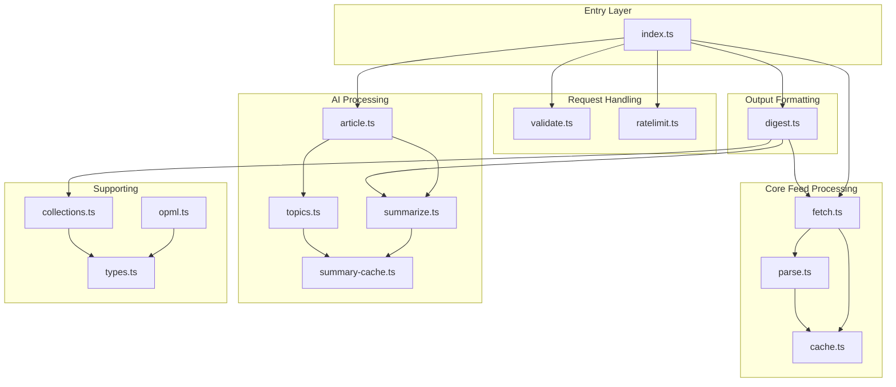
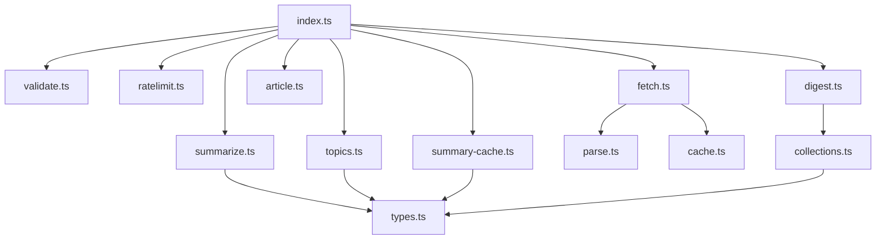

# RSS Agent - Components

This document provides detailed documentation for each component (module) in the RSS Agent codebase, including responsibilities, interfaces, dependencies, and implementation details.

[← Back to MOC](./README.md)

## Component Overview



**Total Components:** 14 TypeScript modules
**Lines of Code:** ~2,500 (excluding tests)
**Test Files:** 15+ test suites

---

## Table of Contents

1. [index.ts - Entry Point & Routing](#indexts---entry-point--routing)
2. [validate.ts - URL Validation](#validatets---url-validation)
3. [ratelimit.ts - Rate Limiting](#ratelimitts---rate-limiting)
4. [fetch.ts - Feed Fetching](#fetchts---feed-fetching)
5. [parse.ts - RSS/Atom Parsing](#parets---rssatom-parsing)
6. [cache.ts - Feed Caching](#cachet---feed-caching)
7. [article.ts - Article Extraction](#articlets---article-extraction)
8. [summarize.ts - AI Summarization](#summarizets---ai-summarization)
9. [topics.ts - Topic Extraction](#topicsts---topic-extraction)
10. [summary-cache.ts - Summary Caching](#summary-cachet---summary-caching)
11. [digest.ts - Digest Formatting](#digestts---digest-formatting)
12. [collections.ts - Feed Collections](#collectionsts---feed-collections)
13. [opml.ts - OPML Parsing](#opmlt---opml-parsing)
14. [types.ts - Type Definitions](#typests---type-definitions)

---

## index.ts - Entry Point & Routing

**Path:** [worker/src/index.ts](../../worker/src/index.ts)

**Responsibility:**
- Worker entry point (Cloudflare Workers API)
- Request routing to handlers
- HTTP method validation
- Global error handling
- Response formatting

**Key Functions:**

### `fetch(request: Request, env: Env): Promise<Response>`
Worker entry point - routes requests to appropriate handlers.

**Routes:**
- `GET /health` → Health check
- `POST /fetch` → Single feed fetch
- `POST /batch` → Batch feed fetch
- `POST /summarize` → AI summarization
- `POST /digest` → Complete digest pipeline

### `handleFetch(request: Request, env: Env): Promise<Response>`
Handles `/fetch` endpoint - single feed with caching.

**Flow:**
1. Check rate limit
2. Validate URL
3. Fetch feed (with or without cache)
4. Apply filters (since, limit)
5. Return formatted response

**Lines:** 208-287

### `handleBatch(request: Request, env: Env): Promise<Response>`
Handles `/batch` endpoint - parallel multi-feed fetch.

**Flow:**
1. Check rate limit
2. Validate feeds array
3. Fetch all feeds in parallel (Promise.all)
4. Optionally summarize items (parallel)
5. Return aggregated results

**Lines:** 289-450

### `handleSummarize(request: Request, env: Env): Promise<Response>`
Handles `/summarize` endpoint - AI article summarization.

**Flow:**
1. Check rate limit
2. Validate URL
3. Check summary cache
4. Fetch article content
5. Summarize with AI (parallel with topic extraction)
6. Cache result
7. Return summary + topics

**Lines:** 628-752

### `handleDigest(request: Request, env: Env): Promise<Response>`
Handles `/digest` endpoint - complete pipeline.

**Flow:**
1. Check rate limit
2. Resolve collection or custom feeds
3. Fetch all feeds in parallel
4. Summarize all items in parallel
5. Build digest sections
6. Format as Markdown or HTML
7. Return formatted digest

**Lines:** 452-626

### Helper Functions

**`jsonResponse(data: unknown, status = 200): Response`**
- Creates JSON response with appropriate headers

**`errorResponse(error: ErrorResponse, status: number): Response`**
- Creates standardized error response

**`getHttpStatus(errorCode: string): number`**
- Maps error codes to HTTP status codes

**`filterItemsBySince(items: FeedItem[], since: string): FeedItem[]`**
- Filters items by publication date

**`parseShorthandSince(since: string): string`**
- Converts shorthand (24h, 7d) to ISO date

**`applyFilters(items: FeedItem[], since?, limit?): FeedItem[]`**
- Combines date and limit filtering

**`getClientId(request: Request): string`**
- Extracts client identifier for rate limiting

**Dependencies:**
- `validate.ts` - URL validation
- `fetch.ts` - Feed fetching
- `parse.ts` - RSS parsing (indirect via fetch)
- `cache.ts` - KV caching (indirect via fetch)
- `article.ts` - Article extraction
- `summarize.ts` - AI summarization
- `summary-cache.ts` - Summary caching
- `topics.ts` - Topic extraction
- `digest.ts` - Digest formatting
- `ratelimit.ts` - Rate limiting

**Interfaces:**
```typescript
interface Env {
  FEED_CACHE: KVNamespace;
  AI: Ai;
}

interface FetchRequestBody {
  url?: string;
  since?: string;
  limit?: number;
  forceRefresh?: boolean;
}

interface BatchRequestBody {
  feeds?: BatchFeedInput[];
  since?: string;
  limit?: number;
  summarize?: boolean;
  summaryStyle?: SummaryStyle;
}

interface SummarizeRequestBody {
  url?: string;
  style?: SummaryStyle;
  forceRefresh?: boolean;
}
```

---

## validate.ts - URL Validation

**Path:** [worker/src/validate.ts](../../worker/src/validate.ts)

**Responsibility:**
- URL format validation
- Scheme validation (http/https only)
- Security checks (prevent SSRF, file:// access)

**Key Functions:**

### `validateUrl(url: string): ValidationResult`
Validates URL for security and format correctness.

**Validation Rules:**
1. Valid URL format (parseable by URL constructor)
2. Scheme must be `http://` or `https://`
3. Rejects `file://`, `data://`, `javascript://`, etc.

**Returns:**
```typescript
interface ValidationResult {
  valid: boolean;
  error?: ErrorCode;
  message?: string;
}
```

**Example:**
```typescript
validateUrl("https://example.com/feed.xml")
// → { valid: true }

validateUrl("file:///etc/passwd")
// → { valid: false, error: "invalid_url", message: "Invalid URL scheme" }
```

**Dependencies:** None

**Used By:**
- `index.ts` - All endpoints that accept URLs
- `fetch.ts` - Before fetching feeds

---

## ratelimit.ts - Rate Limiting

**Path:** [worker/src/ratelimit.ts](../../worker/src/ratelimit.ts)

**Responsibility:**
- Per-client request throttling
- Sliding window rate limiting
- KV-based counter storage

**Key Functions:**

### `checkRateLimit(kv: KVNamespace, clientId: string): Promise<RateLimitResult>`
Checks if client has exceeded rate limit.

**Algorithm:**
- Sliding window (60 seconds)
- Max requests: 100 per window
- Counter stored in KV with expiration

**Returns:**
```typescript
interface RateLimitResult {
  allowed: boolean;
  retryAfter?: number;  // Seconds until limit resets
}
```

### `incrementRateLimit(kv: KVNamespace, clientId: string): Promise<void>`
Increments request counter for client.

**KV Key:** `ratelimit:{clientId}`
**TTL:** 60 seconds

**Example:**
```typescript
const result = await checkRateLimit(env.FEED_CACHE, "192.168.1.1");
if (!result.allowed) {
  return errorResponse({
    error: "rate_limited",
    message: "Too many requests",
    retryAfter: result.retryAfter
  }, 429);
}

await incrementRateLimit(env.FEED_CACHE, "192.168.1.1");
```

**Configuration:**
- Window: 60 seconds (configurable)
- Max requests: 100 (configurable)

**Dependencies:**
- Cloudflare KV (for counter storage)

**Used By:**
- `index.ts` - All endpoints before processing requests

---

## fetch.ts - Feed Fetching

**Path:** [worker/src/fetch.ts](../../worker/src/fetch.ts)

**Responsibility:**
- HTTP fetching of RSS feeds
- Timeout and abort handling
- Conditional requests (ETag, If-Modified-Since)
- Cache integration

**Key Functions:**

### `fetchFeed(url: string): Promise<ParseResult>`
Fetches and parses RSS feed without caching.

**Flow:**
1. HTTP GET request to feed URL
2. Check status code (404, 5xx, etc.)
3. Extract response text
4. Parse XML → RSS/Atom
5. Return parsed result

**Timeout:** 10 seconds (configurable)

### `fetchFeedWithCache(url: string, cache: KVNamespace): Promise<ParseResult>`
Fetches feed with KV cache integration.

**Flow:**
1. Generate cache key (SHA-256 of URL)
2. Check KV cache for existing feed
3. If cached, check if conditional request needed (ETag, Last-Modified)
4. If cache miss, fetch and parse
5. Store in cache (15min TTL)
6. Return result with `cached` flag

**Cache Keys:**
- `feed:{hash}:content` - Parsed feed JSON
- `feed:{hash}:etag` - ETag header value
- `feed:{hash}:modified` - Last-Modified header value

**Conditional Requests:**
```typescript
const headers: Record<string, string> = {};

const etag = await cache.get(`feed:${hash}:etag`);
if (etag) headers["If-None-Match"] = etag;

const modified = await cache.get(`feed:${hash}:modified`);
if (modified) headers["If-Modified-Since"] = modified;

const response = await fetch(url, { headers });

if (response.status === 304) {
  // Not modified - return cached content
  return cachedFeed;
}
```

**Error Handling:**
| Status | Error Code | Description |
|--------|-----------|-------------|
| 404 | `feed_not_found` | Feed URL not found |
| 408/504 | `timeout` | Request timeout |
| 5xx | `feed_not_found` | Server error |
| Parse error | `parse_error` | XML parsing failed |

**Dependencies:**
- `parse.ts` - RSS/Atom parsing
- `cache.ts` - KV cache helpers

**Used By:**
- `index.ts` - `/fetch` and `/batch` endpoints
- `digest.ts` - Digest generation

---

## parse.ts - RSS/Atom Parsing

**Path:** [worker/src/parse.ts](../../worker/src/parse.ts)

**Responsibility:**
- RSS 2.0 XML parsing
- Atom feed parsing
- Feed metadata extraction
- Item extraction and normalization

**Key Functions:**

### `parseFeed(xml: string): ParseResult`
Main parser - detects format and delegates to specific parser.

**Format Detection:**
- Checks for `<rss` tag → RSS 2.0
- Checks for `<feed` tag with Atom namespace → Atom
- Falls back to best-effort parsing

### `parseRss(doc: Document): ParseResult`
Parses RSS 2.0 feeds.

**Extracted Fields:**

**Feed Metadata:**
- `title` - Feed title
- `url` - Feed link
- `description` - Feed description
- `lastUpdated` - pubDate or lastBuildDate

**Items:**
- `title` - Item title
- `url` - Item link
- `published` - pubDate
- `summary` - description or content:encoded
- `author` - dc:creator or author
- `categories` - category tags

### `parseAtom(doc: Document): ParseResult`
Parses Atom feeds.

**Namespace Handling:**
```typescript
const ATOM_NS = "http://www.w3.org/2005/Atom";

const entries = doc.querySelectorAll("entry");
entries.forEach(entry => {
  const title = entry.querySelector("title")?.textContent;
  const link = entry.querySelector('link[rel="alternate"]')?.getAttribute("href");
  // ...
});
```

**Field Mapping:**
- `title` → title
- `link[rel="alternate"]` → url
- `published` or `updated` → published
- `summary` or `content` → summary
- `author > name` → author
- `category` → categories

**Dependencies:**
- Browser DOM API (available in Cloudflare Workers)
- DOMParser for XML parsing

**Used By:**
- `fetch.ts` - After fetching feed XML

**Error Handling:**
- Returns `parse_error` if XML is malformed
- Gracefully handles missing optional fields

---

## cache.ts - Feed Caching

**Path:** [worker/src/cache.ts](../../worker/src/cache.ts)

**Responsibility:**
- KV cache key generation
- Feed content caching
- ETag/Last-Modified header caching
- Cache expiration management

**Key Functions:**

### `getCacheKey(url: string): Promise<string>`
Generates deterministic cache key from URL.

**Algorithm:**
```typescript
const encoder = new TextEncoder();
const data = encoder.encode(url);
const hashBuffer = await crypto.subtle.digest("SHA-256", data);
const hashArray = Array.from(new Uint8Array(hashBuffer));
const hashHex = hashArray.map(b => b.toString(16).padStart(2, "0")).join("");

return `feed:${hashHex}:content`;
```

**Key Format:** `feed:{sha256(url)}:content`

### `cacheFeed(kv: KVNamespace, url: string, feed: ParseResult): Promise<void>`
Stores feed in cache with 15-minute TTL.

**Stored Keys:**
- `feed:{hash}:content` - JSON.stringify(feed)
- `feed:{hash}:etag` - ETag header value (if present)
- `feed:{hash}:modified` - Last-Modified header value (if present)

**TTL:** 900 seconds (15 minutes)

### `getCachedFeed(kv: KVNamespace, url: string): Promise<ParseResult | null>`
Retrieves cached feed if available.

**Returns:**
- `ParseResult` if cached and not expired
- `null` if cache miss or expired

**Dependencies:**
- Cloudflare KV
- Web Crypto API (for SHA-256)

**Used By:**
- `fetch.ts` - Feed caching logic

---

## article.ts - Article Extraction

**Path:** [worker/src/article.ts](../../worker/src/article.ts)

**Responsibility:**
- Full article content extraction from URLs
- HTML parsing and cleaning
- Text content extraction
- Error handling for inaccessible articles

**Key Functions:**

### `fetchArticleContent(url: string): Promise<ArticleResult>`
Fetches full article HTML and extracts text content.

**Flow:**
1. HTTP GET request to article URL
2. Parse HTML response
3. Extract main content (heuristics)
4. Clean HTML tags, scripts, styles
5. Return plain text content + title

**Content Extraction Heuristics:**
- Look for `<article>` tag
- Look for elements with `main-content`, `article-body`, etc. classes
- Fall back to `<body>` content
- Remove `<script>`, `<style>`, `<nav>`, `<footer>`

**Returns:**
```typescript
interface ArticleResult {
  success: boolean;
  content?: string;
  title?: string;
  error?: ErrorCode;
  message?: string;
}
```

**Error Handling:**
| Status | Error Code | Description |
|--------|-----------|-------------|
| 404 | `article_not_found` | Article URL not found |
| Extraction fail | `content_extraction_failed` | Could not extract content |
| Network error | `timeout` | Request timeout |

**Example:**
```typescript
const result = await fetchArticleContent("https://example.com/article");

if (result.success) {
  console.log(result.title);     // "Article Title"
  console.log(result.content);   // "Full article text..."
}
```

**Dependencies:** None (uses fetch API)

**Used By:**
- `index.ts` - `/summarize` endpoint
- `index.ts` - `/batch` endpoint (when summarize=true)
- `index.ts` - `/digest` endpoint

---

## summarize.ts - AI Summarization

**Path:** [worker/src/summarize.ts](../../worker/src/summarize.ts)

**Responsibility:**
- AI-powered text summarization
- Workers AI integration
- Summary style handling (brief, detailed, bullets)
- Input truncation for token limits

**Configuration:**

```typescript
const PRIMARY_MODEL = "@cf/mistralai/mistral-small-3.1-24b-instruct";
const MAX_INPUT_LENGTH = 32000;  // characters
```

**Key Functions:**

### `summarizeText(text: string, ai: Ai, options?: SummarizeOptions): Promise<SummarizeResult>`
Generates AI summary of text content.

**Parameters:**
```typescript
interface SummarizeOptions {
  style?: SummaryStyle;  // "brief" | "detailed" | "bullets"
}
```

**System Prompts:**

| Style | Prompt | Output |
|-------|--------|--------|
| `brief` | "Summarize in 1-2 sentences. Focus on the key point only." | 1-2 sentences |
| `detailed` | "Summarize in a comprehensive paragraph..." | Full paragraph |
| `bullets` | "Summarize as 3-5 bullet points, each starting with a dash..." | 3-5 bullet points |

**Flow:**
1. Validate input (non-empty)
2. Truncate if > MAX_INPUT_LENGTH
3. Build system + user messages
4. Call Workers AI
5. Extract summary from response
6. Return result

**Workers AI Call:**
```typescript
const response = await ai.run(PRIMARY_MODEL, {
  messages: [
    { role: "system", content: systemPrompt },
    { role: "user", content: inputText }
  ]
});

const summary = typeof response === "string"
  ? response
  : response.response;
```

**Returns:**
```typescript
interface SummarizeResult {
  success: boolean;
  summary?: string;
  model?: string;
  error?: ErrorCode;
  message?: string;
}
```

**Error Handling:**
- Returns `summarization_failed` if AI call fails
- Graceful degradation (doesn't block other operations)

**Dependencies:**
- Workers AI binding (`Ai`)

**Used By:**
- `index.ts` - `/summarize` endpoint
- `index.ts` - `/batch` endpoint (optional)
- `index.ts` - `/digest` endpoint

---

## topics.ts - Topic Extraction

**Path:** [worker/src/topics.ts](../../worker/src/topics.ts)

**Responsibility:**
- Keyword/topic extraction from text
- AI-powered topic identification
- Topic normalization (lowercase, hyphenated)

**Key Functions:**

### `extractTopics(text: string, ai: Ai): Promise<TopicResult>`
Extracts 3-5 key topics from text using AI.

**System Prompt:**
```
You are a topic extraction assistant. Extract 3-5 key topics or keywords
from the following text. Return ONLY the topics as a comma-separated list,
lowercase, hyphenated. Example: machine-learning, neural-networks, pytorch
```

**Flow:**
1. Truncate text if needed
2. Call Workers AI with extraction prompt
3. Parse comma-separated response
4. Normalize topics (trim, lowercase, hyphenate)
5. Return array of topics

**Example:**
```typescript
const result = await extractTopics(articleContent, env.AI);

if (result.success) {
  console.log(result.topics);
  // ["machine-learning", "transformers", "llm", "fine-tuning"]
}
```

**Returns:**
```typescript
interface TopicResult {
  success: boolean;
  topics?: string[];
  error?: ErrorCode;
  message?: string;
}
```

**Dependencies:**
- Workers AI binding (`Ai`)

**Used By:**
- `index.ts` - `/summarize` endpoint (parallel with summarization)

**Notes:**
- Topic extraction is optional - doesn't fail summarization if it errors
- Topics are cached along with summary for 24 hours

---

## summary-cache.ts - Summary Caching

**Path:** [worker/src/summary-cache.ts](../../worker/src/summary-cache.ts)

**Responsibility:**
- AI summary caching (24-hour TTL)
- Cache key generation (URL + style)
- Summary retrieval and storage

**Key Functions:**

### `getCachedSummary(kv: KVNamespace, url: string, style: SummaryStyle): Promise<CachedSummary | null>`
Retrieves cached summary for URL + style combination.

**Cache Key:** `summary:{sha256(url)}:{style}`

**Returns:**
```typescript
interface CachedSummary {
  summary: string;
  title?: string;
  model: string;
  topics?: string[];
}
```

### `cacheSummary(kv: KVNamespace, url: string, style: SummaryStyle, data: CachedSummary): Promise<void>`
Stores summary in cache with 24-hour TTL.

**TTL:** 86400 seconds (24 hours)

**Rationale:**
- Articles rarely change after publication
- Enables "daily digest" use case with cached results
- First user pays AI cost, subsequent users get instant results

**Example:**
```typescript
// Check cache first
const cached = await getCachedSummary(kv, articleUrl, "brief");
if (cached) {
  return { summary: cached.summary, cached: true };
}

// Cache miss - summarize and cache
const result = await summarizeText(content, ai, { style: "brief" });
await cacheSummary(kv, articleUrl, "brief", {
  summary: result.summary,
  title: articleTitle,
  model: result.model,
  topics: extractedTopics
});
```

**Dependencies:**
- Cloudflare KV
- Web Crypto API (for SHA-256)

**Used By:**
- `index.ts` - `/summarize`, `/batch`, `/digest` endpoints

---

## digest.ts - Digest Formatting

**Path:** [worker/src/digest.ts](../../worker/src/digest.ts)

**Responsibility:**
- Digest section building
- Markdown formatting
- HTML formatting
- Built-in collection definitions

**Collection Definitions:**

```typescript
export const COLLECTIONS: Record<string, {...}> = {
  "ai-ml": {
    name: "AI & Machine Learning",
    feeds: [
      { url: "https://huggingface.co/blog/feed.xml", name: "Hugging Face Blog" },
      { url: "https://openai.com/blog/rss.xml", name: "OpenAI Blog" }
    ]
  },
  "tech-news": {
    name: "Tech News",
    feeds: [
      { url: "https://feeds.arstechnica.com/arstechnica/index", name: "Ars Technica" },
      { url: "https://www.theverge.com/rss/index.xml", name: "The Verge" }
    ]
  },
  "dev-tools": {
    name: "Development & Infrastructure",
    feeds: [
      { url: "https://blog.cloudflare.com/rss/", name: "Cloudflare Blog" },
      { url: "https://github.blog/feed/", name: "GitHub Blog" }
    ]
  }
};
```

**Key Functions:**

### `buildDigestSections(batchResults: Array<...>): DigestSection[]`
Builds digest sections from batch feed results.

**Flow:**
1. Filter successful feed results
2. Group items by feed (source)
3. Create section per feed with articles array

**Returns:**
```typescript
interface DigestSection {
  source: string;
  articles: DigestArticle[];
}

interface DigestArticle {
  title: string;
  url: string;
  published?: string;
  summary: string;
  source: string;
}
```

### `formatDigestMarkdown(sections: DigestSection[], title?: string): string`
Formats digest as Markdown.

**Structure:**
```markdown
# {title}

*Generated: {date}*

## {Source 1}

### [{Article Title}]({url})
*{published date}*

{summary}

## {Source 2}
...

---
*Powered by rss-agent + Workers AI (Mistral)*
```

### `formatDigestHtml(sections: DigestSection[], title?: string): string`
Formats digest as email-ready HTML.

**Features:**
- Inline styles (email compatibility)
- Responsive design (max-width: 600px)
- System font stack
- Semantic HTML structure
- Proper HTML escaping

**Example HTML Output:**
```html
<!DOCTYPE html>
<html>
<head>
  <meta charset="utf-8">
  <meta name="viewport" content="width=device-width, initial-scale=1">
  <title>Daily Digest</title>
</head>
<body style="font-family: -apple-system, ...; max-width: 600px; ...">
  <header>
    <h1>Daily Digest</h1>
    <p><em>Generated: November 30, 2025</em></p>
  </header>
  <main>
    <!-- Articles -->
  </main>
  <footer>
    <p><em>Powered by rss-agent + Workers AI (Mistral)</em></p>
  </footer>
</body>
</html>
```

**Dependencies:**
- None (pure formatting functions)

**Used By:**
- `index.ts` - `/digest` endpoint

---

## collections.ts - Feed Collections

**Path:** [worker/src/collections.ts](../../worker/src/collections.ts)

**Responsibility:**
- Feed collection type definitions
- Collection validation
- Collection management utilities

**Note:** Actual collection data is embedded in `digest.ts` to keep worker self-contained.

**Interfaces:**
```typescript
interface CollectionFeed {
  url: string;
  name: string;
}

interface FeedCollection {
  id: string;
  name: string;
  description?: string;
  tags?: string[];
  feeds: CollectionFeed[];
}

interface FeedCollectionsDocument {
  collections: FeedCollection[];
}
```

**Dependencies:**
- `types.ts`

**Used By:**
- `digest.ts` - Collection definitions

---

## opml.ts - OPML Parsing

**Path:** [worker/src/opml.ts](../../worker/src/opml.ts)

**Responsibility:**
- OPML file parsing
- Feed list extraction
- Category grouping

**OPML Format:**
```xml
<opml version="2.0">
  <head>
    <title>My Feeds</title>
  </head>
  <body>
    <outline text="Tech News" title="Tech News">
      <outline text="Ars Technica" xmlUrl="..." htmlUrl="..." type="rss"/>
      <outline text="The Verge" xmlUrl="..." htmlUrl="..." type="rss"/>
    </outline>
  </body>
</opml>
```

**Key Functions:**

### `parseOpml(xml: string): OpmlDocument`
Parses OPML XML into structured format.

**Returns:**
```typescript
interface OpmlDocument {
  title: string;
  dateModified?: string;
  categories: OpmlCategory[];
}

interface OpmlCategory {
  text: string;
  title: string;
  feeds: OpmlFeed[];
}

interface OpmlFeed {
  text: string;
  xmlUrl: string;
  htmlUrl: string;
  type: string;
}
```

**Dependencies:**
- DOMParser (XML parsing)

**Used By:**
- Future: OPML import/export functionality

**Status:** Implemented but not currently exposed in API

---

## types.ts - Type Definitions

**Path:** [worker/src/types.ts](../../worker/src/types.ts)

**Responsibility:**
- Shared TypeScript type definitions
- Interface definitions
- Type exports for other modules

**Key Types:**

### Core Response Types
```typescript
interface HealthResponse {
  status: "ok";
  version: string;
  timestamp: string;
}

interface ErrorResponse {
  error: ErrorCode;
  message: string;
  retryAfter?: number;
}

type ErrorCode =
  | "invalid_url"
  | "feed_not_found"
  | "parse_error"
  | "rate_limited"
  | "timeout"
  | "invalid_input"
  | "summarization_failed"
  | "content_extraction_failed"
  | "article_not_found"
  | "topic_extraction_failed";
```

### Feed Types
```typescript
interface ValidationResult {
  valid: boolean;
  error?: ErrorCode;
  message?: string;
}

interface FeedMetadata {
  title: string;
  url: string;
  description?: string;
  lastUpdated?: string;
}

interface FeedItem {
  title: string;
  url: string;
  published?: string;
  summary?: string;
  author?: string;
  categories: string[];
}

interface ParseResult {
  success: boolean;
  feed?: FeedMetadata;
  items?: FeedItem[];
  error?: ErrorCode;
  message?: string;
}
```

### OPML Types
```typescript
interface OpmlFeed {
  text: string;
  xmlUrl: string;
  htmlUrl: string;
  type: string;
}

interface OpmlCategory {
  text: string;
  title: string;
  feeds: OpmlFeed[];
}

interface OpmlDocument {
  title: string;
  dateModified?: string;
  categories: OpmlCategory[];
}
```

### Collection Types
```typescript
interface CollectionFeed {
  url: string;
  name: string;
}

interface FeedCollection {
  id: string;
  name: string;
  description?: string;
  tags?: string[];
  feeds: CollectionFeed[];
}

interface FeedCollectionsDocument {
  collections: FeedCollection[];
}
```

**Dependencies:** None

**Used By:** All modules

---

## Component Dependencies

### Dependency Graph



### Module Coupling

| Module | Incoming Dependencies | Outgoing Dependencies | Coupling |
|--------|---------------------|---------------------|----------|
| `types.ts` | 13 | 0 | Low |
| `validate.ts` | 2 | 1 | Low |
| `parse.ts` | 2 | 1 | Low |
| `cache.ts` | 2 | 1 | Low |
| `summarize.ts` | 3 | 1 | Low |
| `topics.ts` | 1 | 1 | Low |
| `article.ts` | 3 | 0 | Low |
| `ratelimit.ts` | 1 | 0 | Low |
| `fetch.ts` | 3 | 2 | Medium |
| `digest.ts` | 1 | 2 | Medium |
| `index.ts` | 0 | 9 | High |

**Design Goal:** Keep most modules loosely coupled with single responsibility.

---

## Testing Strategy

### Unit Tests

Each component has corresponding test file:
- `test/validate.test.ts`
- `test/parse.test.ts`
- `test/cache.test.ts`
- `test/fetch.test.ts`
- `test/summarize.test.ts`
- etc.

**Coverage:**
- Happy path scenarios
- Error conditions
- Edge cases (empty input, malformed data)
- Integration between components

### Integration Tests

**`test/agent/workflows.test.ts`**
- End-to-end agent workflows
- Multi-component integration
- Real-world scenarios

### E2E Tests

**`test/e2e/`**
- Tests against deployed worker
- Real HTTP requests
- Production-like conditions

**Test Count:** 267 tests total

---

## Code Quality Metrics

| Metric | Value | Target |
|--------|-------|--------|
| Total Lines (src) | ~2,500 | - |
| Average File Size | ~180 lines | <300 |
| Test Coverage | 267 tests | >200 |
| TypeScript Errors | 0 | 0 |
| Max Function Length | ~150 lines | <200 |
| Cyclomatic Complexity | Low-Medium | Low |

**Quality Practices:**
- Strict TypeScript (`tsc --noEmit`)
- Consistent error handling
- Comprehensive type definitions
- Extensive test coverage
- Clear separation of concerns

---

[← Back to MOC](./README.md) | [Features →](./features.md)
